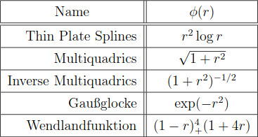
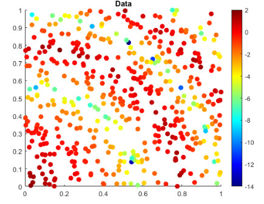
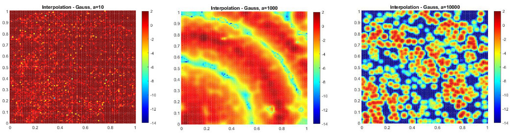

# Interpolation
Interpolation ist das Abschätzen von Werten in den Bereichen zwischen bemessenen Datenpunkten. Die angenäherten Werte in den Zwischenräumen werden je nach Funktion gewichtet.
*hier fehlt was*  
Wir betrachten hier speziell die radiale Basisfunktion, eine eindimensionale Funktion, bei der die Messwerte genau getroffen werden. Dabei sind die Werte nur vom Ort und dem Abstand, also dem Radius zum Messwert abhängig.

## Radiale Basisfunktion

Die Interpolation mittels der radialen Basisfunktionen (RBF) ist eine nicht gitterbasierte, exakte Interpolationsmethode. Das bedeutet, dass alle Messpunkte in der interpolierten Oberfläche enthalten sind. Ziel dieser Interpolationsmethode ist es, mit den Funktionen die Oberfläche weitestgehend zu glätten. Dafür gibt es fünf verschiedene radiale Basisfunktionen mit je verschiedenen Formen, die entsprechend zu unterschiedlichen Interpolationsflächen führen. Dabei wird die Fläche glatter, je öfter differentierbar die verwendete Funktion ist.

*Abb. 1: Die verschiedenen Funktionen, Seite 8[^1], 7.10.2022, 15:09*

### Splines

Splines sind stark mit den radialen Basisfunktionen verwandt. Sie sind auch nicht-gitterbasiert. Die Werte werden mittels mathematischer Funktionen bestimmt. Die Oberfläche wird geglättet und verläuft durch die Messpunkte. Splines sind aufgrund ihrer Recheneigenschaften sehr beliebt. Bei den RBFs ist wie bei den Splines ein kubisches Polynom die Basis für die Interpolation. Trotzdem sind nicht alle RBFs Splines.[^2]

Die Interpolation mittels RBFs ist bildlich vorstellbar, als würde eine Gummimatte in das vermessene Gelände gelegt werden, sodass diese sich an die Höhe der Messwerte anpasst und die Bereiche dazwischen ausgleicht. Die Genauigkeit der erechneten Werte zwischen den bemessenen Punkten werden mittels Kreuzvalidierung bestimmt. Dazu wird die Interpolation mit Testdaten durchgeführt und der zu erwartende Fehler Vorhersage abgeschätzt. Die Beispielwerte und ihre Fehler werden nun untereinander verglichen und die Genauigkeit wird berechnet. [^3]

Ziel der Interpolation ist es, die insgesamte Oberflächenwölbung der entstehende Fläche zu minimieren, also eine hohe Glättung zu erzielen.
Die RBFs bieten dabei Vorteile gegenüber der globalen oder lokalen Polynomeninterpolation, da aufgrund der Eigenschaft der Exaktheit die interpolierte Fläche die tatsächlichen Messwerte enthält. Im Vergleich zu den inversen und distanzgewichteten Profilen sagen die Basisfunktionen auch Werte über bzw. unter den gemessenen Werten voraus:
*HIER FEHLT WAS*

*Abb. 2: Interpolation mittels RBF, 21.9.2022, 10:37*

Ein Vorteile der RBFs ergibt sich aus der Gitterfreiheit der Interpolation. Gitterbasierter Methoden liegt immer ein Raster oder eine Triangulierung zugrunde. Das schränkt die Verwenudng mit Bestimmten Datensätzen ein oder erhöht die Vorarbeit in Form der Triangulierung. Nummerisch sind die RBFs so formuliert, dass man aus ihnen intuitive Eigenschaften ablesen kann, zum Beispiel das Abfallen einer Funktion.
Ein weiterer Vorteil ist, dass RBFs den zu interpolierenden Raum von den gegebenen Datenpunkten abhängig machen. Verändern sich die Messpunkte, verändert sich auch das Gebiet, welches interpoliert werden soll. Das ist essentiell um im multivarianten Raum zu interpolieren. [^1]
In der Glättung der Oberfläche liegt auch ein Nachteil. Enthält das tatsächliche, bemessene Gebiet stark lokal begrenzten Extrempunkt, so wird dieser in der interpolierten Fläche geglättet und unter Umständen sind Maximalwert und lokale Begrenzung nicht mehr zu erkennen. Deshalb ist die Interpolation mittels radialer Basisfunktionen nicht geeignet für starke Variationen in kurzen Abständen in der Messumgebung oder falls die gemessenen Daten (stark) fehlerbehaftet sind. In diesem Fall führt eine Interpolation mit dem Ziel die Oberfläche zu glätten natürlich dazu, dass die Werte sehr falsch sind.

Verwendet werden die RBFs zum Glätten leicht variierender Oberflächen wie beispielsweise für Geländeprofile. Außerdem verwendet man sie in der angewandten Mathematik oder in den Neurowissenschaften. [^1] Es wird angenommen, dass unser Gehirn Reize analog zur Interpolation mit RBFs darstellt. Die Vermutung basiert darauf, dass Neuronenantworten in den primären sensorischen Arealen, wie die Interpolation, abstandabhängig sind [^4].

Um zu interpolieren wird über jedem Punkt, ob Messwert oder nicht, eine der fünf Basisfunktionen gebildet.

*Abb. 3: Spezieller Fall der multiquadratischen RBF, 21.9.2022, 10:36*

Die Funktion ändert sich mit Abstand von einem gemessenen Punkt, da die "Funktionswerte nur vom euklidischen Abstand der Argumente abhängig sind"[^5].
Dasselbe passiert vermutlich mit den Neuronenantworten in unseren Gehirnen.

Die Vorhersage der Werte wird nun durch die gewichteten Durchschnittswerte zwischen den Werten, die die RBFs an der zu interpolierenden Stelle annehmen, (siehe Abb. 3) gebildet. Die durch die verschiedenen Funktionen gegebenen Werte werden gemittelt und gewichtet um einen Wert für die Interpolation der Oberfläche zu erhalten.
Die Gewichtungen der Werte ergeben sich durch Verschiebung der Vorhersage an einen Punkt mit gemessenem Wert. Wird eine Vorhersage an einen Punkt mit gemessenen Werten verschoben, stimmt die RBF an dieser Stelle, da ihr ja ein Messwert als Ausgangswert der Funktion zugrunde liegt. Das führt zu so vielen Gleichungen, wie es gemessene Werte gibt. Sie enthalten unbekannte Gewichte. Das entstandene Gleichungssystem kann damit eindeutig gelöst werden und sorgt für genaue Vorhersagen im gesamten Oberflächenbereich. Die Lösbarkeit und Eindeutigkeit sind stark abhängig von der Wahl der Basisfunktion und dem Parameter zur Glättung. Gegebenenfalls ereicht man nämlich stark verschiedene Ergebnisse mit den unterschiedlichen Funktionen.
Um eine möglichst ebene Oberfläche zu erhalten, enthalten alle RBFs einen Parameter, der die Glätte der Oberfläche überprüft. Für diesen gilt allgemein: 'Je höher der Parameterwert, desto glatter ist die Karte'. Nur bei der inversen, multiquadratischen Basisfunktion gilt das Gegenteil. Ein niedriger Parameterwert führt hier zu einer glatteren Oberfläche.

*Abb. 4: Interpolation mittels verschienender Parameter, wie in der Vorlesung 6, Folie 5.*

[^1]: https://num.math.uni-goettingen.de/picap/pdf/E562.pdf 22.9.2022, 11:51

[^2]: https://desktop.arcgis.com/de/arcmap/10.7/tools/spatial-analyst-toolbox/comparing-interpolation-methods.htm#ESRI_SECTION1_44CF7274A3FE455DB9D528308BB8001D 22.9.2022, 12:21

[^3]: https://datamines.de/cross-validation/ 22.9.2022, 17:36

[^4]: https://www.spektrum.de/lexikon/neurowissenschaft/radiales-basisfunktionen-netzwerk/10668 22.9.2022, 10:03

[^5]: Zitat: https://num.math.uni-goettingen.de/picap/pdf/E562.pdf Seite 8, Zeile 4f.

Quellen:

https://desktop.arcgis.com/de/arcmap/10.4/extensions/geostatistical-analyst/how-radial-basis-functions-work.htm 27.7.2022, 17:30

Vorlesungsfolien Einführung in die Geoinformatik Nummer 5 und 6, sowie Notizen dazu
